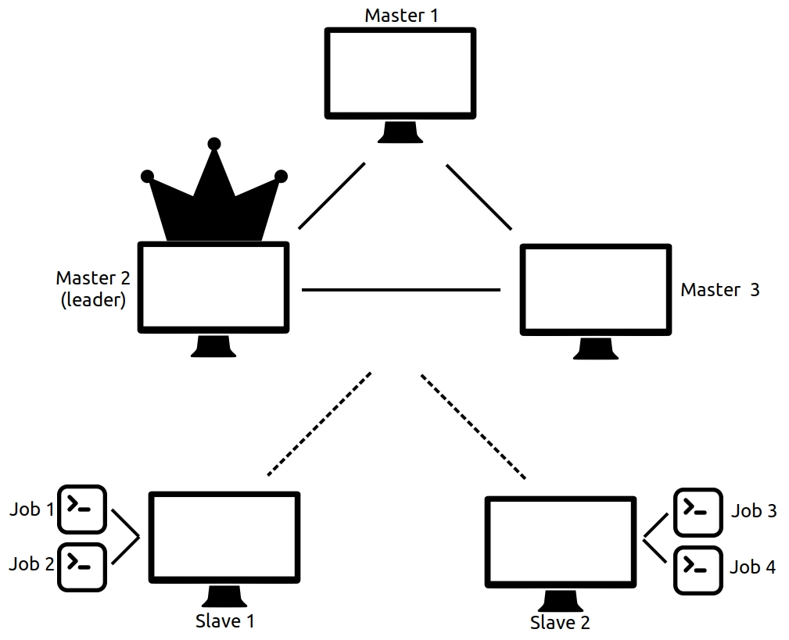
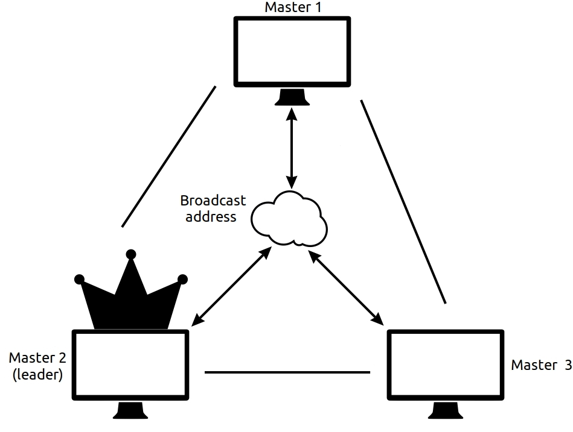
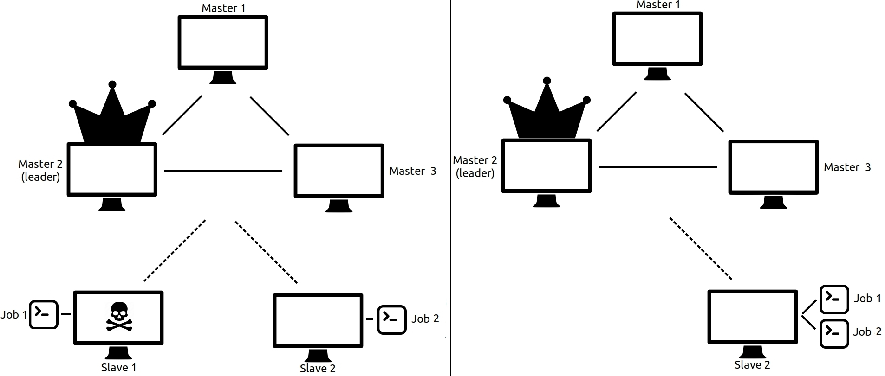
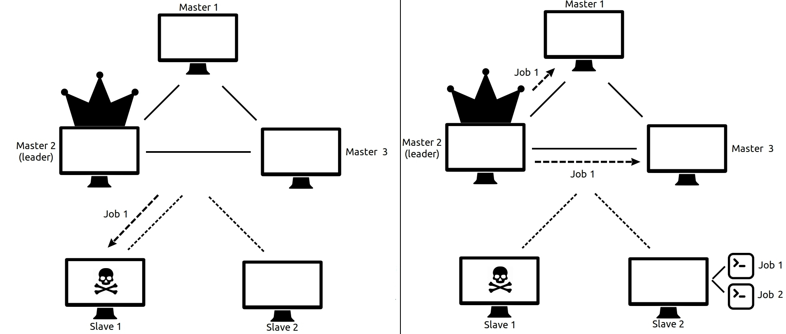

# Introduction

As learned on previous courses, distributed systems present a lot of advantages
over monolithic services. Such advantages come over with an increase of the
system complexity, as the same is distributed between several nodes. Many
algorithms exist to face these situations, but we consider there are not many
practical examples of them.

Hence, looking forward to test some of these algorithms by our own, we proposed
to develop a distributed platform for orchestrating applications via a computers
cluster. This way, we had to deal with topics such as leader election, fault
tolerance and state reconciliation. The following sections further explain how
our cluster work, what problems we had to face and how we solved them.

# Architecture overview

CLAUD has a master-slave architecture, and nodes are therefore classified in two
categories: master nodes, and slave nodes. Master nodes have the responsibility
of keeping track of everything: which nodes are alive, which jobs exist and
where are they running. They also expose an API for users to interact with the
cluster. 

Master nodes go through a process for electing a leader node among themselves.
The leader node is the only one that can alter the state of the cluster, and all
write queries are forwarded to it. The other master slaves are considered
followers and act only as replicas of the state; whenever the leader fails, all
follower masters perform a new election and reconcile the state of the cluster.
See section on leader election for details on how this is performed, and how
reconciliation occurs.

On the other hand, slaves nodes are only responsible for running the jobs and 
keeping track of them. Slave nodes are then the worker nodes of the cluster,
being the ones yielding the resources. The following picture sumarizes this
whole architecture:

# Masters leader election

The masters leader election is based on a very simple algorithm, in which the master
with the lowest ID is considered as the leader of the cluster. To successfully perform
that election, a discovery protocol must take part and all nodes have to announce
themselves via an UDP broadcast address. Then, after a certain amount of time, all
masters know which nodes are participating on the leader election, and can pick the
proper leader based on their IDs. The figure belows represent this situation:

Once the leader has been elected, it becomes responsible of managing all operations 
that change the clusters state, such as launching, stopping or rescheduling jobs.
Additionally, the leader also forwards such information to the other masters, thus
ensuring a global cluster state. Hence, it is _not_ necessary for the masters to
perform a new leader election every time a new master joins or leaves the cluster,
because the current cluster leader is already capable of handling the cluster state.
Then, only after a failure of that cluster leader a new leader election will be needed.
We chose, however, to forcefully set the cluster to an "inoperating state" (no more
jobs can be launched) if more than half of the original master nodes fail. We considered
this a good way of ensuring enough masters are always up while making changes to the
cluster state. We also opted to always trigger a leader election after the cluster 
recovering from this inoperating state.

# Nodes state reconciliation

Two options where considered when discussing which kind of information should
the master nodes maintain: 1) every master has a global view of the state of the
cluster, and 2) every master knows only a subset of tasks and slave nodes.

Option 2 seemed to be a more natural option for a distributed system, as
information is never centralized, and each master would be able to operate
independently of the other ones. However, it has the main disadvantage that it
makes the task of keeping track of available resources, and thus scheduling a
new job really hard.

Option 1 is really well suited for that, since any master can see at a glance
which resources are available because all of them store the global state. The
trick here is how to maintain that state consistent upon failure of any of the
members of the cluster. We took some time considering many edge cases and arrived 
to the conclusion that it would be manageable with proper state reconciliation.

Following this reasoning, we opted for option 1. Consequently, each master node
contains all the information of the state of the cluster. This information is
kept in two in-memory tables:

  - **Alive nodes**: lists every node in the cluster. Keeps track of resources 
    on each node.
  - **Job list**: lists all the jobs in the cluster, its state and which node
    is currently running in.

This way, every time a new job needs to be launched, the leader of the cluster can
easily schedule (i.e. look for a node with enough resources) and launch it. Moreover,
whenever a slave node running one or more jobs fails, the leader can reschedule that
job on any other node of the cluster. This can be easily accomplished by constantly
looking after the updates of the alive nodes table, and checking for jobs running on
failing nodes on the job list:

In order to keep this global state consistent, the leader of the cluster must forward
all write requests to the other master nodes. The other masters will then update their
state and, as long as the leader does not fail, the state of the cluster will remain
consistent. In case of a failure of the leader node, a new election will be triggered
between all masters, and the new leader will have to validate its own state against
the other nodes (since the leader could have failed while the cluster state was being
updated). 

For such state reconciliation, we chose to _trust each node about their own state_. For
example, if the new leader thinks some slave is running a job but that slave reports
back it is not, then the new leader will update its state in concordance with that. This
combined with the different states a job can have during its lifecycle (explained on
next section) allows the cluster to face and solve many different problems, ensuring a
consistent global state.

# Job lifecycle

As it would be expected, jobs on the cluster can have different states depending on the
possible node failures. On the most optimistic scenario, a job can be scheduled and remain
running forever on a never-failing node. We called this "working" state as _running state_ 
and it is really desired to have all jobs on this state most of the time. 

When a slave node running a job fails, the leader of the cluster should reallocate such 
job on another slave node as discussed on the previous section. Since all nodes are constantly 
listening to the broadcast address, detecting such failure and rescheduling the jobs is not
really that hard. However, in order to keep the global state consistent, the leader must
forward the "launching job" message to all the other master nodes, because it is a request
that changes the state of the cluster. At this point, many edgy cases can be considered and
discussed, and many solutions can be designed to solve all of them. Since our cluster relies
on a master leader node, the main problem we tried to address was considering this special
node failure. 

Hence, we came to notice that, if the leader master were to fail _just after scheduling the job_, 
this could led to some inconsistent state on the cluster or the loss of that job data. Since the
leader failure would trigger a new leader election and state reconciliation between all nodes,
if the leader were to fail after sending some "launch job" message to a slave node such slave 
would be the only node on the cluster knowing about the existence of that job. Then, if that
slave were also to fail before the leader election finished, the job would end being lost. To
prevent that, we considered having the leader node forwarding the job message to the master
nodes _before_ actually sending it to the slave node. The picture below shows how this job data
could be lost or preserved on the other master nodes just by changing the order in which the
job messages are sent:

Now, if the leader were to fail right after sending the job message to the masters but 
before sending it to the slave node, the job data would still remain on the remaining
masters. After the leader election, since that job could either be or not running (because
the job may or may not have been scheduled, and the slave node may or may not have failed)
all masters would have to mark that job on their jobs lists as on _pending state_. This
way, during state reconciliation the leader can change the pending jobs to running ones
if slaves nodes really report to have them (remember we chose to trust each node about
their own state).

On the other hand, we made the leader to periodically check on pending jobs remaining
and reschedule them. Then, if some time has elapsed and the slave that was supposedly
running some job has not reported it, that pending job on that node is marked as _lost_
and a new job with the same data is rescheduled on another slave.

# Conclusions

To sum up, we were able to successfully develop from scratch the proposed
platform, facing and solving many problems inherent to distributed systems. The
implemented cluster can launch jobs and reschedule them when a node fails, thus
providing its main service as an orchestration platform. Although we know there
are many things to improve, we consider the main goal for this project was
achieved, since we have successfully discussed and implemented various relevant
distributed algorithms.
